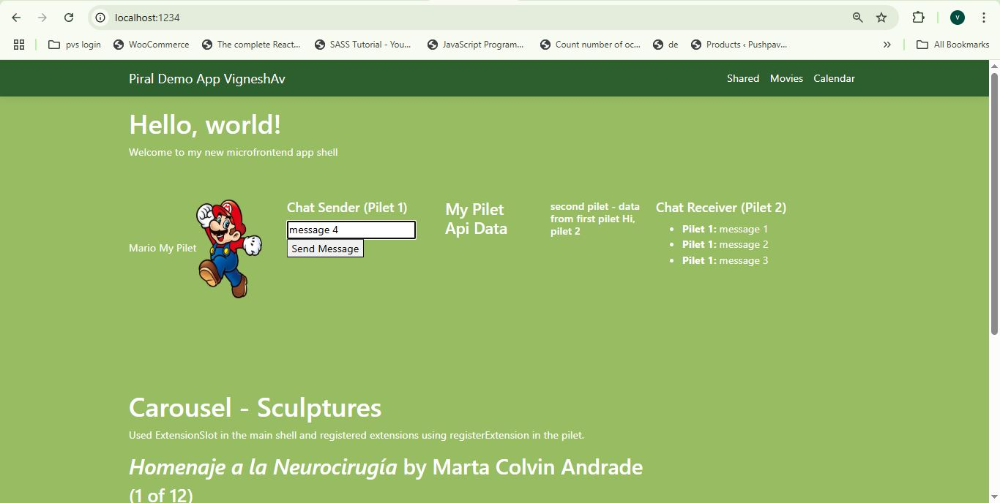
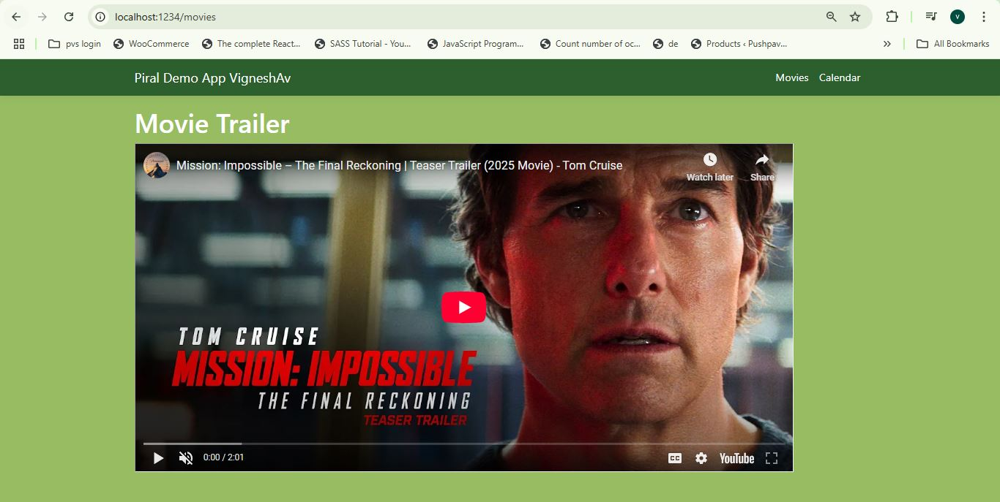
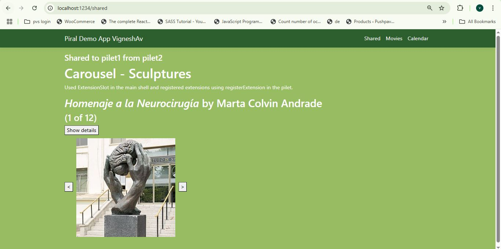

# Piral Demo App VigneshAv
    Screenshots attached
- Created Main shell Piral Instance
- Improved CSS
- Added ExtensionSlot for Carousel
- Created First Pilet
- Registered Mario Tile
- Registered Mario page/route
- In Mario page, Added Mario Game in iframe 
- Registered Api tile
- Got Data from API and Displayed it in UI
- Register Movie Menu
- Registered Movie Page
- Added Youtube Movie Trailer in Movie page
- Shared Data to second pilet
- Created Second Pilet
- Registered Calendar Page
- Registered Calendar Menu
- Registered Tile to get and show data from first pilet
- Registered Extension to extend Carousel to main shell
- Shared Carousel component from pilet2 to pilet1 using Extension
- Registered tile for Chat Sender in Pilet1
- Registered tile for Chat Receiver in Pilet2
- Added Input and button to get Message
- Used Emit to send the Message from Pilet1
- Used on to receive Message in Pilet2
- Published Pilets to Piral Feed Service
  
HomePage from Main Shell 

Carousel Page from Pilet2

Mario Page from Pilet1

Api Data Page from Pilet1

Movie trailer Page from Pilet1

Calendar Page from Pilet2
   
Component Shared from Pilet2 to Pilet1
   
