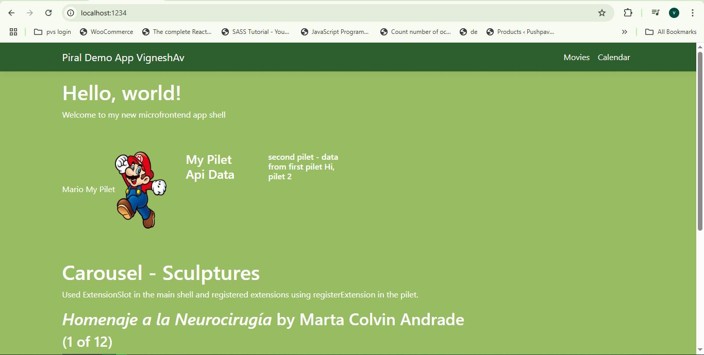
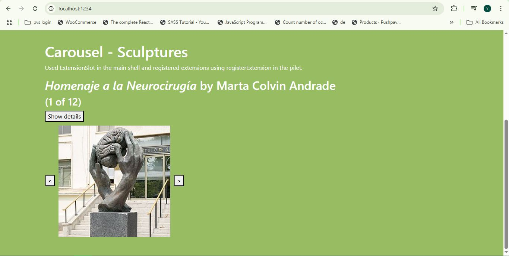
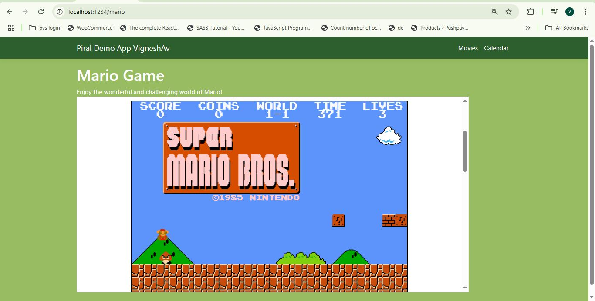
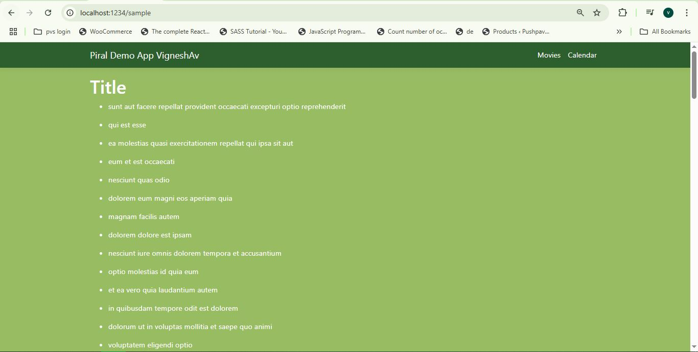
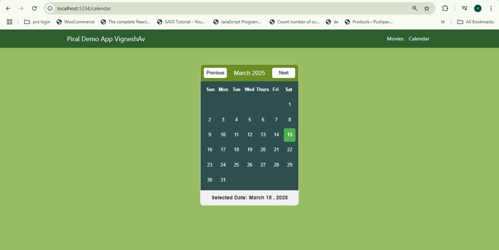

# Piral Demo App VigneshAv
    Screenshots attached
- Created Main shell Piral Instance
- Improved CSS
- Added ExtensionSlot for Carousel
- Created First Pilet
- Registered Mario Tile
- Registered Mario page/route
- In Mario page, Added Mario Game in iframe 
- Registered Api tile
- Got Data from API and Displayed it in UI
- Register Movie Menu
- Registered Movie Page
- Added Youtube Movie Trailer in Movie page
- Shared Data to second pilet
- Created Second Pilet
- Registered Calendar Page
- Registered Calendar Menu
- Registered Tile to get and show data from first pilet
- Registered Extension to extend Carousel

   